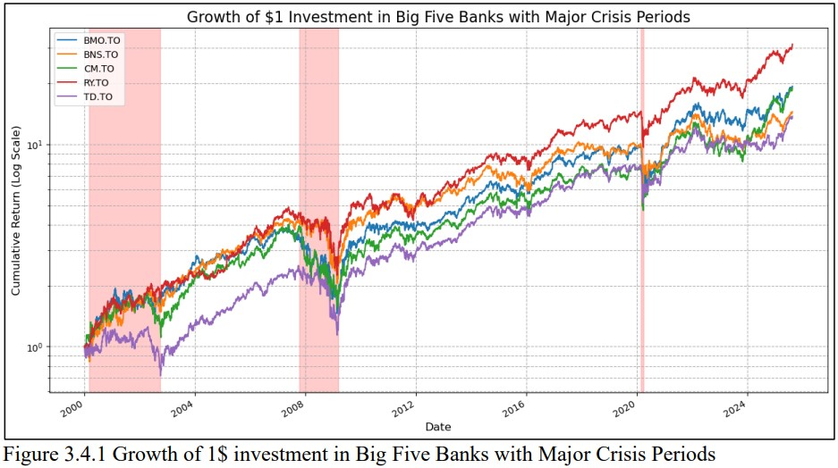
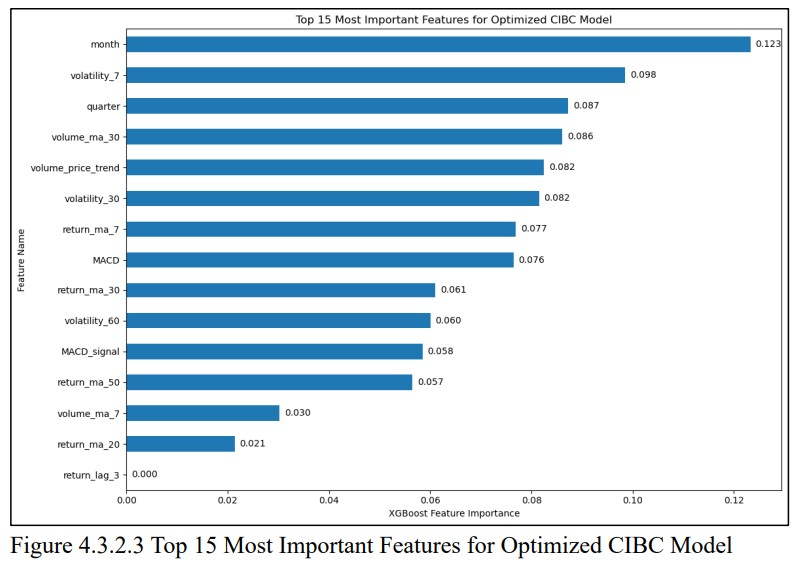

# Comprehensive Analysis of the Big Five Canadian Banks' Stock Performance (2000-2025)

## Project Summary

This project provides an in-depth analysis of the stock performance of Canada's "Big Five" banks—RBC, TD, BMO, Scotiabank, and CIBC—from 2000 to 2025. The analysis covers historical performance, risk-adjusted returns, and resilience during major financial crises. The project culminates in the development of an XGBoost predictive model to forecast future stock returns and provide a data-driven investment recommendation. The primary goal is to demonstrate a full-cycle data analysis workflow, from data collection and cleaning to exploratory analysis, predictive modeling, and clear communication of insights.

## Skills Demonstrated

*   **Data Analysis & Visualization:** Python (Pandas, NumPy, Matplotlib, Seaborn)
*   **Time Series Analysis:** Analyzing trends, volatility, and performance over time.
*   **Statistical Analysis:** Correlation analysis, regression, and hypothesis testing.
*   **Machine Learning:** Predictive modeling using XGBoost for forecasting stock returns.
*   **Data Wrangling:** Sourcing data via APIs (yfinance), cleaning, and feature engineering.
*   **Reporting:** Clearly communicating complex findings through visuals and structured analysis.

## Project Overview and Objective

The objective of this case study is to analyze the historical stock performance of the Big Five Canadian banks to identify patterns in volatility, correlation, and risk-adjusted returns. The project aims to answer key questions, including:

*   Which bank has been the most volatile, and does higher volatility lead to higher returns?
*   How correlated are the stock returns of these major financial institutions?
*   Which bank has delivered the best risk-adjusted performance?
*   How resilient were these banks during significant economic downturns like the Dot-Com Burst, the 2008 Financial Crisis, and the COVID-19 Crash?

The project concludes with a predictive modeling phase to forecast 30-day returns for the highest and lowest-risk banks, providing a forward-looking investment recommendation.

## Data Source

Historical stock data for the Big Five Canadian banks (RY.TO, TD.TO, BMO.TO, BNS.TO, CM.TO) was sourced from Yahoo Finance using the `yfinance` library in Python. The dataset covers the period from January 1, 2000, to September 13, 2025, and includes daily metrics such as adjusted closing prices and trading volumes.

## Methodology

1.  **Data Collection:** Retrieved historical stock data using the `yfinance` API.
2.  **Exploratory Data Analysis (EDA):**
    *   Calculated daily returns to normalize the data for comparison.
    *   Conducted a correlation analysis to measure the relationship between the banks' stock performances.
    *   Analyzed volatility (standard deviation of daily returns) and average returns to test the risk-reward relationship.
    *   Calculated the Sharpe Ratio to evaluate risk-adjusted returns.
    *   Analyzed performance during three major financial crises to assess resilience.
3.  **Predictive Modeling:**
    *   Selected Royal Bank of Canada (RBC) as the low-risk, stable performer and Canadian Imperial Bank of Commerce (CIBC) as the high-risk, volatile counterpart for a "Risk vs. Reward" predictive analysis.
    *   Engineered 36 features for each bank, including time-based, momentum, trend, volatility, and volume features.
    *   Developed two independent XGBoost models to predict the 30-day future return for RBC and CIBC.
    *   Optimized the models by selecting the top 15 most important features to improve performance and interpretability.
4.  **Investment Recommendation:** Used the final, optimized models to generate a 30-day return forecast and provide a data-driven recommendation.

## Key Findings

### Historical Performance (2000-2025)
*   The stock returns of the Big Five banks are **highly correlated** (Pearson coefficients between 0.72 and 0.76), indicating they generally move as a cohesive block in response to market-wide factors.
*   **CIBC was the most volatile bank**, while **RBC exhibited the lowest volatility**.
*   The conventional "higher risk, higher reward" hypothesis was **not supported** by the data; CIBC's higher volatility did not translate to higher average returns.
*   **RBC delivered the highest risk-adjusted returns** (the highest Sharpe Ratio), identifying it as the top-performing leader on a risk-adjusted basis.

### Resilience During Crises
*   RBC consistently demonstrated superior resilience and faster recovery during the Dot-Com Burst, the 2008 Global Financial Crisis, and the COVID-19 Crash. During the 2008 crisis, CIBC's stock declined by over 61%, whereas RBC's drawdown was contained to approximately 51%.

## Predictive Modeling: RBC vs. CIBC

The predictive modeling phase aimed to determine which bank—the stable leader (RBC) or the volatile counterpart (CIBC)—would offer superior returns in the near future.

*   **RBC Model:** An optimized XGBoost model for RBC achieved an R-squared of 2.7%. The model's predictions were most influenced by long-term market context and seasonality (e.g., financial quarter, 60-day volatility).
*   **CIBC Model:** The CIBC model required a simpler structure to extract a reliable signal from its noisier data, achieving an R-squared of 1.5%. Its future returns were more sensitive to recent, short-term volatility (7-day volatility).

*(Note: Save Figure 4.3.1.3 from your report and place it here.)*

*(Note: Save Figure 4.3.2.3 from your report and place it here.)*

## Results and Investment Recommendation

The final 30-day return forecasts generated by the optimized models are as follows:

| Bank                 | Risk Profile         | Final Predicted Return (%) |
|----------------------|----------------------|----------------------------|
| **Royal Bank (RBC)** | Low Risk / Stable    | **8.33%**                  |
| **CIBC**             | High Risk / Volatile | **2.44%**                  |

**Recommendation:** Based on the predictive models, an investment in **Royal Bank of Canada (RBC)** is recommended for an investor aiming to maximize returns over the next 30-day period. The analysis concludes that the stable, lower-risk asset is poised to significantly outperform its more volatile peer.

## Limitations

*   The models' predictions are based entirely on historical price and volume data and do not account for future macroeconomic events, changes in interest rate policy, or company-specific news.
*   The low R-squared values, while positive and significant in the context of financial forecasting, indicate that the vast majority of stock price movement remains unexplained, highlighting the inherent risk and randomness in the market.
*   This analysis is for academic purposes and should not be considered financial advice.

## How to Use This Repository

1.  Clone the repository: `git clone https://github.com/your-username/your-repo-name.git`
2.  Install the required libraries: `pip install -r requirements.txt`
3.  Explore the complete analysis in the Jupyter Notebook: `Canadian_Banks_Stock_Analysis.ipynb`.
4.  For a detailed overview of the project, please refer to the full report: `Data_Analytics_Case_Study_Big_Five_Banks.pdf`.
